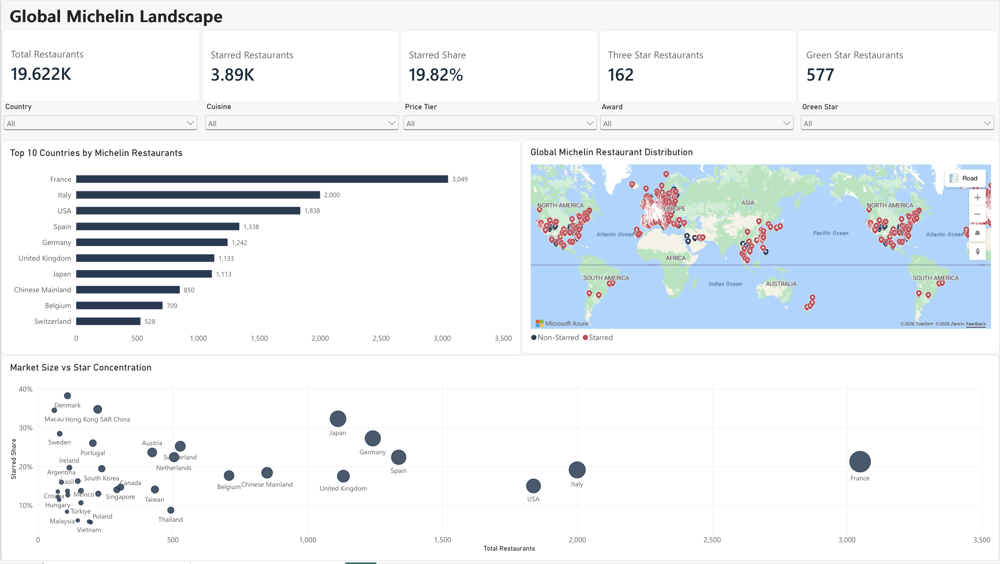
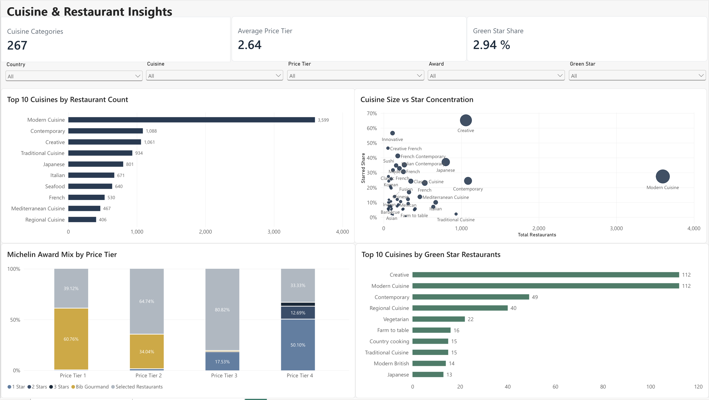

# Michelin Guide Global Restaurant Analytics

An end-to-end data analytics project exploring how Michelin recognition is distributed across global markets, cuisines, price segments, and restaurant categories.

The project transforms 19,622 Michelin Guide restaurant records through a Bronze, Silver, and Gold data pipeline in Databricks, validates data quality using SQL, and connects the analytics-ready dataset to Power BI for interactive reporting.

## Project Overview

Michelin Guide data contains rich information about restaurants around the world, but the raw data alone does not make it easy to understand how Michelin recognition varies across markets.

This project was built to answer questions such as:

- Where is Michelin recognition concentrated globally?
- How do cuisine and price level differ across Michelin markets?
- Which cuisines have higher concentrations of starred restaurants?
- How does Michelin award composition vary across price tiers?
- How is Green Star recognition distributed across cuisines and markets?

## Tech Stack

- **Databricks** — cloud analytics platform and medallion architecture
- **SQL** — data profiling, cleaning, transformation, quality validation, and exploratory analysis
- **Power BI** — semantic modeling, DAX measures, data visualization, and interactive dashboards
- **GitHub** — project documentation and version control

## Data Architecture

The project follows a medallion-style architecture to separate raw ingestion, data cleaning, validation, and analytics-ready data.

```text
Public Michelin Restaurant Data
              │
              ▼
         Databricks
              │
              ▼
      Bronze Layer
       Raw ingestion
              │
              ▼
      Silver Layer
 Cleaning & standardization
              │
              ▼
     Data Quality Gate
 Validation & reconciliation
              │
              ▼
       Gold Layer
 Analytics-ready dataset
              │
              ▼
      SQL Analytics
              │
              ▼
         Power BI
              │
              ▼
 Interactive Analytics Dashboard
```

### Bronze Layer

The raw dataset was ingested into Databricks with **19,622 restaurant records and 14 source fields**. The Bronze layer preserves the original data for traceability.

### Silver Layer

The Silver layer cleans and standardizes the raw data. Key transformations include:

- Created a deterministic SHA-256 `restaurant_id` from restaurant and location attributes.
- Standardized restaurant, address, location, and cuisine fields.
- Converted international price symbols into a consistent 1–4 `price_tier`.
- Derived `star_count`, `is_starred`, and `is_green_star`.
- Preserved the original price field for traceability.

### Data Quality Gate

Validation checks were performed before promoting the data to the Gold layer:

- Reconciled Bronze and Silver row counts.
- Verified **19,622 unique and non-null restaurant IDs**.
- Checked required fields and coordinate validity.
- Validated price tiers and Michelin star counts.
- Confirmed consistency between star count and starred status.

### Gold Layer

The Gold layer contains the analytics-ready restaurant dataset used by Power BI. It includes standardized geography, cuisine, price tier, Michelin award, star status, Green Star status, and geographic coordinates.

## Power BI Dashboard

The analytics-ready Gold dataset was connected directly from Databricks to Power BI to build a two-page interactive dashboard. The report includes synchronized filters for country, cuisine, price tier, Michelin award, and Green Star status.

### Global Michelin Landscape

This page provides a high-level view of Michelin's global restaurant landscape, including restaurant volume, starred restaurant concentration, geographic distribution, and differences across major markets.



### Cuisine & Restaurant Insights

This page explores restaurant characteristics in greater detail, including leading cuisines, star concentration by cuisine, Michelin award composition across price tiers, and Green Star recognition.



## Key Insights

- **France has the largest Michelin presence** in the dataset with 3,049 restaurants, followed by Italy with 2,000 and the United States with 1,838.
- **Japan stands out for Michelin-star concentration among major markets:** 359 of its 1,113 restaurants are starred, representing approximately 32.3%.
- **Tokyo is the largest city-level Michelin market** in the dataset with 545 restaurants, while Paris follows with 451 and London with 375.
- **Creative cuisine shows a particularly high concentration of starred restaurants:** 691 of 1,061 restaurants, or approximately 65.1%, are Michelin-starred.
- **Higher price tiers contain a larger share of starred restaurants in this dataset.** This represents an observed association rather than evidence that higher prices cause Michelin recognition.
- **Green Star recognition remains relatively uncommon**, with 577 restaurants representing approximately 2.94% of the 19,622 restaurants analyzed.

## Dataset Summary

| Metric | Value |
|---|---:|
| Restaurants | 19,622 |
| Countries | 52 |
| Cities | 6,113 |
| Cuisine Categories | 267 |
| Starred Restaurants | 3,890 |
| Three-Star Restaurants | 162 |
| Green Star Restaurants | 577 |
| Green Star Share | 2.94% |
